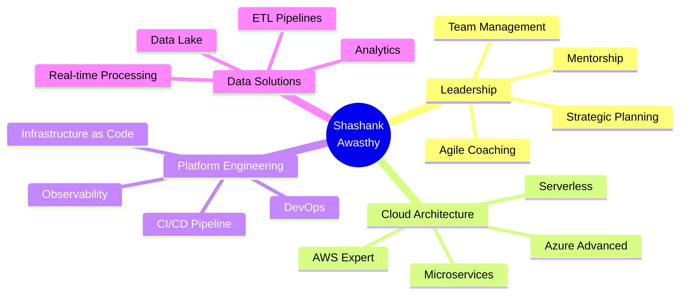

<div align="center">

<!-- Header Banner -->


<!-- Alternative: Custom Header with Tech Stack -->
<!-- Uncomment below and comment above if you prefer a different style -->
<!--

-->

[](https://git.io/typing-svg)

<br>

<!-- Social Links -->

[](https://www.linkedin.com/in/shashank-awasthy-86568417/)
[](mailto:shatvik1766@gmail.com)
[](https://github.com/Shashank1766)


</div>

---

## 💼 About Me

I'm a **Software Engineering Manager** passionate about building resilient platforms and empowering engineering teams to deliver excellence. With over **15 years** of hands-on experience, I've architected enterprise-grade solutions across **Life Sciences**, **Healthcare**, and **BFSI** domains.

### 🚀 What I Bring to the Table

<table>
<tr>
<td width="50%" valign="top">

#### 🏗️ **Technical Leadership**
- ✅ Architect cloud-native, distributed systems
- ✅ Design microservices with AWS & Azure
- ✅ Drive platform engineering excellence
- ✅ Implement observability & SRE practices

</td>
<td width="50%" valign="top">

#### 👨‍💼 **People Leadership**
- ✅ Manage & mentor 25+ engineers
- ✅ Foster high-performance culture
- ✅ Champion agile & DevOps adoption
- ✅ Build scalable engineering processes

</td>
</tr>
</table>

---

## 🎯 Impact at a Glance

<div align="center">

| 💰 Cost Optimization | ⚡ Performance | 👥 Team Leadership | 📈 Delivery Speed |
|:---:|:---:|:---:|:---:|
| **$1M+ Saved** | **40% Less Downtime** | **25+ Engineers** | **30% Faster** |

</div>

---


## 📊 GitHub Analytics

<div align="center">


</div>

### 📈 Contribution Activity

<div align="center">

[](https://github.com/Shashank1766)

</div>

---

### 🏆 Career Highlights

```yaml
achievements:
  cost_optimization: "Delivered $1M+ annual savings through strategic cloud optimization"
  performance: "Reduced production downtime by 40% with improved monitoring & incident response"
  delivery: "Increased team velocity by 30% through CI/CD automation & agile transformation"
  recognition: 
    - "Security Champion 2023 - SOX Compliance Leadership"
    - "Multiple Team Excellence Awards"
  
expertise:
  architecture: ["Microservices", "Event-Driven", "Serverless", "API Design"]
  cloud: ["AWS Step Functions", "Lambda", "S3", "Azure Functions"]
  data: ["Large-scale ETL", "Real-time Processing", "Data Lake Architecture"]
  security: ["SOX Compliance", "Zero Trust", "Security-First Design"]
```

---

## 🛠️ Core Technology Stack

<div align="center">

### **Primary Technologies**

<a href="#"></a>

### **Cloud & Infrastructure**

<a href="#"></a>

### **DevOps & Tools**

<a href="#"></a>

### **Databases**

<a href="#"></a>

</div>

<details>
<summary>📦 <b>View Extended Tech Stack & Tools</b> (Click to expand)</summary>
<br>

**Frontend & UI**
```
Angular • AngularJS • Bootstrap • Chart.js • jQuery • Handlebars • Storybook
```

**Backend & APIs**
```
.NET Core • Node.js • Express.js • FastAPI • ASP.NET • Blazor
```

**Data Processing & Analytics**
```
Apache Spark • Apache Airflow • Snowflake • Elasticsearch • Power BI
```

**Testing & Quality Assurance**
```
Selenium • Playwright • Jasmine • SonarQube • SonarLint • Postman
```

**CI/CD & Automation**
```
GitHub Actions • Argo CD • Jenkins • Helm • Gulp • NPM • Yarn
```

**Monitoring & Observability**
```
Datadog • CloudWatch • Application Insights • Grafana • ELK Stack
```

**Design & Collaboration**
```
Figma • Canva • Sketch • InVision • Jira • Confluence
```

**Additional Technologies**
```
Nginx • Apache Tomcat • JWT • Swagger • Firebase • Cloudflare
```

</details>


## 🏅 Achievements & Recognition

<div align="center">


</div>

---

## 🎯 Skills Proficiency

<div align="center">



</div>

---

## 🔭 Current Focus & Learning Journey

<table>
<tr>
<td width="50%">

### 🎯 **Exploring**
- 🤖 Generative AI for enterprise solutions
- ☁️ Advanced cloud-native patterns
- 🔄 GitOps & Platform Engineering
- 📊 Observability & SRE best practices
- 🚀 Developer Experience optimization

</td>
<td width="50%">

### 📚 **Learning**
- 🧠 AI/ML model deployment at scale
- 💰 FinOps & cloud cost optimization
- 🔀 Event-driven architecture patterns
- ⚙️ Kubernetes operators & CRDs
- 🔍 Distributed tracing & APM

</td>
</tr>
</table>

### 📖 Weekly Development Breakdown

<!--START_SECTION:waka-->
```text
Architecture & Design   12 hrs 30 mins  ████████████░░░░░░░░░  48%
Code Reviews            6 hrs 15 mins   ██████░░░░░░░░░░░░░░░  24%
Team Meetings           4 hrs 20 mins   ████░░░░░░░░░░░░░░░░░  16%
Documentation           2 hrs 10 mins   ██░░░░░░░░░░░░░░░░░░░   8%
Learning & Research     1 hr 5 mins     █░░░░░░░░░░░░░░░░░░░░   4%
```
<!--END_SECTION:waka-->

---

## 💡 Leadership Philosophy

<div align="center">

> *"Great engineering teams are built on trust, clear communication, and continuous learning. I believe in empowering engineers to own their solutions while fostering a culture of innovation and excellence."*

</div>

### My Leadership Approach:

<table>
<tr>
<td align="center" width="20%">
  <br>
  <b>Results-Driven</b><br>
  <sub>Focus on measurable business outcomes</sub>
</td>
<td align="center" width="20%">
  <br>
  <b>Data-Informed</b><br>
  <sub>Decisions backed by metrics</sub>
</td>
<td align="center" width="20%">
  <br>
  <b>Collaborative</b><br>
  <sub>Build consensus through communication</sub>
</td>
<td align="center" width="20%">
  <br>
  <b>Growth-Oriented</b><br>
  <sub>Invest in team development</sub>
</td>
<td align="center" width="20%">
  <br>
  <b>Agile Mindset</b><br>
  <sub>Embrace continuous improvement</sub>
</td>
</tr>
</table>

---

## 🤝 Open to Opportunities

<div align="center">

### I'm interested in:

[](mailto:shatvik1766@gmail.com)
[](mailto:shatvik1766@gmail.com)
[](https://www.linkedin.com/in/shashank-awasthy-86568417/)
[](https://github.com/Shashank1766)

</div>

---

## 📬 Let's Connect!

<div align="center">

I'm always open to discussing **cloud architecture**, **platform engineering**, **team leadership**, or collaboration opportunities.

<table>
<tr>
<td align="center" width="33%">
  <a href="https://www.linkedin.com/in/shashank-awasthy-86568417/">
    <br>
    <b>LinkedIn</b><br>
    <sub>Professional Network</sub>
  </a>
</td>
<td align="center" width="33%">
  <a href="mailto:shatvik1766@gmail.com">
    <br>
    <b>Email</b><br>
    <sub>Direct Contact</sub>
  </a>
</td>
<td align="center" width="33%">
  <a href="https://github.com/Shashank1766">
    <br>
    <b>GitHub</b><br>
    <sub>Code & Projects</sub>
  </a>
</td>
</tr>
</table>

### 📊 Response Time

<a href="mailto:shatvik1766@gmail.com">
  
</a>

</div>

---

<div align="center">

### 💭 Random Dev Quote


<br>

### ⭐ Support My Work

If you find my contributions valuable, consider:

[](https://buymeacoffee.com/shashank1766)
[](https://github.com/sponsors/Shashank1766)

---


**Thanks for visiting! Let's build something amazing together.** 🚀

</div>
